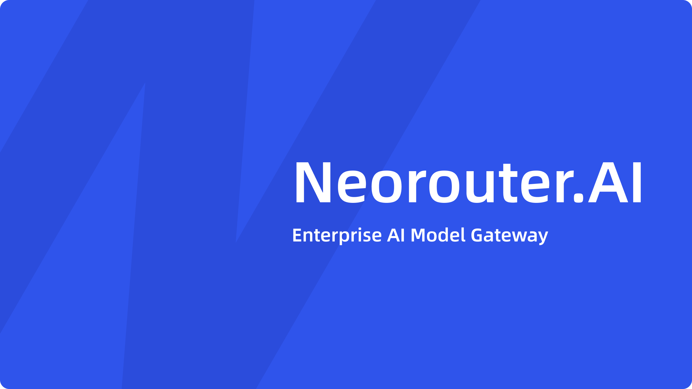

# NeoRouter.AI Docs

NeoRouter.AI 官方开发者文档站，基于 [VitePress](https://vitepress.dev/) 构建。

## 关于 NeoRouter.AI

[NeoRouter.AI](https://neorouter.ai) 是企业级 AI 模型聚合网关，通过统一网关为企业团队提供稳定、透明、可管控的 AI 生产力。

- **正品渠道，原生品质** — 严选渠道接入，原生格式响应，完整能力输出，质量对标官方原厂
- **统一网关，一次接入** — 一个 Key 即可调用全部上架模型（Claude 系列、Codex 系列）
- **精细管控，成本可观测** — 按 Key 划分额度与权限，输入、输出、缓存独立计费
- **企业级保障** — 全天候高可用与自动故障转移，合同定价、月结授信、统一开票

## 本地开发

```bash
# 安装依赖
npm install

# 启动开发服务器
npm run dev

# 构建生产版本
npm run build

# 预览构建产物
npm run preview
```

## 文档结构

```
docs/
├── data.json                 # 文档源数据（中英文内容）
├── index.md                  # 首页
├── zh/                       # 中文首页
├── scripts/sync-docs.mjs     # 从 data.json 同步生成文档页面
├── .vitepress/
│   ├── config.ts             # VitePress 配置
│   └── theme/                # 自定义主题与组件
└── public/                   # 静态资源
```

`npm run sync` 会从 `data.json` 自动生成各文档页面和侧边栏配置。

## 部署

推送到 `main` 分支后，GitHub Actions 自动构建并部署到 GitHub Pages。

## 联系

- 商务咨询：support@neorouter.ai
- 官网：https://neorouter.ai
